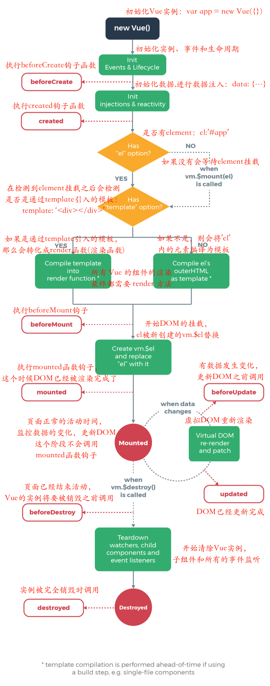

# vue源码分析 - 生命周期篇

在我们实际项目开发过程中，会非常频繁地和 Vue 组件的生命周期打交道，今天，从源码的角度来看一下这些生命周期的钩子函数执行时机与如何被执行的。

项目初始化执行 `var app = new Vue({})` 

### new Vue（）做了哪些事情？

我们来看一下源码，在src/core/instance/index.js 中

```javascript
function Vue (options) {
  if (process.env.NODE_ENV !== 'production' &&
    !(this instanceof Vue)
  ) {
    warn('Vue is a constructor and should be called with the `new` keyword')
  }
  this._init(options)
}

initMixin(Vue)
stateMixin(Vue)
eventsMixin(Vue)
lifecycleMixin(Vue)
renderMixin(Vue)

export default Vue
```
Vue 初始化主要就干了几件事情，合并配置，初始化生命周期，初始化事件中心，初始化渲染，初始化 data、props、computed、watcher 等等。

### 生命周期的定义：

  · 每个 Vue 实例在被创建时都要经过一系列的初始化过程——例如，需要设置数据监听、编译模板、将实例挂载到 DOM 并在数据变化时更新 DOM 等。同时在这个过程中也会运行一些叫做生命周期钩子的函数，这给了用户在不同阶段添加自己的代码的机会。

首先，先看一张很熟悉的图：



其中展示了8个生命周期，在vue@2.5.16版本中 又新增了3个，共11个生命周期钩子，下面是每一个的解释：

  · 1、beforeCreate：在实例初始化之后，数据观测 (data observer) 和 event/watcher 事件配置之前被调用。 
  · 2、created：在实例创建完成后被立即调用。在这一步，实例已完成以下的配置：数据观测 (data observer)，属性和方法的运算，watch/event 事件回调。然而，挂载阶段还没开始，$el 属性目前不可见。 
  · 3、beforeMount：在挂载开始之前被调用：相关的 render 函数首次被调用。 
  · 4、mounted：el 被新创建的 vm.$el 替换，并挂载到实例上去之后调用该钩子。如果 root 实例挂载了一个文档内元素，当 mounted 被调用时 vm.$el 也在文档内（PS:注意 mounted 不会承诺所有的子组件也都一起被挂载。如果你希望等到整个视图都渲染完毕，可以用 vm.$nextTick 替换掉 mounted：）。vm.$nextTick会在后面的章节详细讲解，这里大家需要知道有这个东西。 
  · 5、beforeUpdate：数据更新时调用，发生在虚拟 DOM 打补丁之前。这里适合在更新之前访问现有的 DOM，比如手动移除已添加的事件监听器。 
  · 6、updated：由于数据更改导致的虚拟 DOM 重新渲染和打补丁，在这之后会调用该钩子。当这个钩子被调用时，组件 DOM 已经更新，所以你现在可以执行依赖于 DOM 的操作。然而在大多数情况下，你应该避免在此期间更改状态。如果要相应状态改变，通常最好使用计算属性或 watcher 取而代之（PS:计算属性与watcher会在后面的章节进行介绍）。 
  · 7、activated：keep-alive 组件激活时调用（PS：与组件相关，关于keep-alive会在讲解组件的时候为大家介绍）。 
  · 8、deactivated：keep-alive 组件停用时调用（PS：与组件相关，关于keep-alive会在讲解组件的时候为大家介绍）。 
  · 9、beforeDestroy：实例销毁之前调用。在这一步，实例仍然完全可用。 
  · 10、destroyed：Vue 实例销毁后调用。调用后，Vue 实例指示的所有东西都会解绑定，所有的事件监听器会被移除，所有的子实例也会被销毁。 
  · 11、errorCaptured（2.5.0+ 新增）：当捕获一个来自子孙组件的错误时被调用。此钩子会收到三个参数：错误对象、发生错误的组件实例以及一个包含错误来源信息的字符串。此钩子可以返回 false 以阻止该错误继续向上传播。
  · 原文[https://blog.csdn.net/u011068996/article/details/80970284]

接下来我们通过源码来看一下生命周期是怎么执行的，执行函数怎么实现的？
首先我们在/src/core/instance/init.js中，看下`_init`的方法实现。
```javascript
Vue.prototype._init = function (options?: Object) {
    ...
    // expose real self
    vm._self = vm
    initLifecycle(vm)
    initEvents(vm)
    initRender(vm)
    callHook(vm, 'beforeCreate')
    initInjections(vm) // resolve injections before data/props
    initState(vm)
    initProvide(vm) // resolve provide after data/props
    callHook(vm, 'created')
    ...
    if (vm.$options.el) {
      vm.$mount(vm.$options.el)
    }
 }
```
这里出现了两个生命周期：`beforeCreate` 和 `cteated`

在`beforeCreate`前 先调用了initLifecycle(vm)初始化生命周期、initEvents(vm)初始化事件、initRender(vm)渲染函数

在`beforeCreate` 和 `cteated`之间，调用了initInjections(vm)、initState(vm)、initProvide(vm)这三个方法用于初始化data、props、watcher，也就是说这个时候我们已经可以获取到data，props等数据，但还不能够访问DOM（可以通过vm.$nextTick来访问）

在`cteated`之后, 执行 `vm.$mount(vm.$options.el)` 进行 DOM挂载。这里先引入下，后边将详细介绍。

### 生命周期的执行方式
我们能够发现，源码中最终执行生命周期的函数都是调用 callHook 方法，它的定义在 src/core/instance/lifecycle 中：

```javascript
export function callHook (vm: Component, hook: string) {
  // #7573 disable dep collection when invoking lifecycle hooks
  pushTarget()
  const handlers = vm.$options[hook]    // 获取Vue选项中的生命周期钩子函数
  const info = `${hook} hook`
  if (handlers) {
    for (let i = 0, j = handlers.length; i < j; i++) {
      invokeWithErrorHandling(handlers[i], vm, null, vm, info)    // 执行生命周期函数
    }
  }
  if (vm._hasHookEvent) {
    vm.$emit('hook:' + hook)
  }
  popTarget()
}
}
```
比如：触发mounted 钩子方式： 
```
callHook(vm, 'mounted')
```
解释：传入hook，获取vm.$options[hook]对应的回调函数数组，遍历执行。
各个阶段的生命周期函数会被合并到vm.options中，通过callback回调


### DOM挂载：Vue.prototype.$mount原型方法 (mountComponent)


### 页面正常交互: beforeUpdate和updated
这两个钩子函数是在数据更新的时候进行回调的函数, Vue在/src/core/instance/lifecycle.js文件下有一个_update的原型声明：


### 销毁的时候回调：beforeDestroy 、destroyed


### 新增生命周期： activated、deactivated、errorCaptured


(待续)
好了,就写到这了，希望看过后对你能有帮助。


