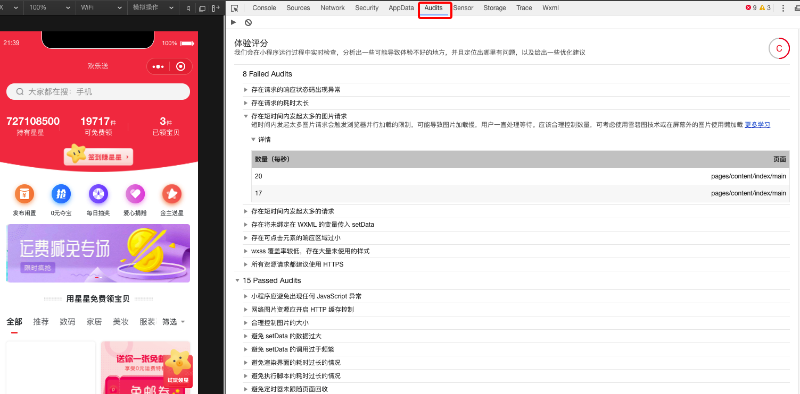
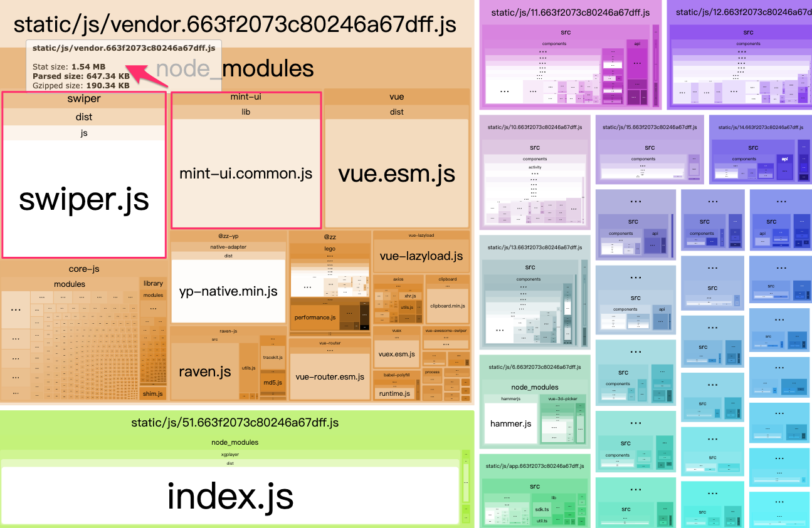

在google中输入“前端性能优化”，可以找到约  11,300,000 条结果，目前性能已经被列入google的网站的排名规则中。

话不多说，直接开始我们的实战吧！

 **本篇将从以下两个方向来进行探讨:**
 	· 提升编译性能
 	· 首屏优化

### 提升编译性能
对于一个大型项目，编译中需要耗时5分钟真的是很鸡肋的事情，无尽的等待，消耗的不只是时间，还有我们搬砖的热情！
2018年2月25日，webpack发布了4.0版本，该版本简化了配置选项等，带来巨大的性能提升，官方曾表示能使编译速度提升 60% - 80%，因此我们决定升级webpack4，从而缩短编译时间，结束漫长的等待。

首先，我们先来了解一下，webpack4 有哪些新特性：

**1、零配置启动项目，简化配置依赖！**
可能是受到parcel的启发，不再强制需要webpack.config.js作为打包配置文件。

**2、mode属性，设置打包环境高效！**
支持两种配置：development || production
``` script
"scripts": {
  "dev": "webpack --mode development",
  "build": "webpack --mode production"
}
```
	将 mode 设置成 development，你将获得最好的开发阶段体验（浏览器调试工具；注释，错误日志和提示；优化的增量构建机制等）
	
	将mode设置成了 production, webpack将会专注项目的部署（优化代码；压缩bundle体积；删除开发阶段代码；Tree-shaking等）

**3、环境支持，代码整洁健壮！**
webpack4不再支持Node4，使用时，确保使用 Node.js的版本 >= 8.9.4。使用了很多JS新的语法，更好的利用ES6语法的优势。

**4、插件删除和优化，减小体积**
删除了CommonsChunkPlugin插件，它使用内置API optimization.splitChunks 和 optimization.runtimeChunk

**5、支持多个头等模块类型，支持 WebAssembly(wasm)**
WebAssembly(wasm)会带来运行时性能的大幅度提升，甚至通过loaders来直接import Rust、C++、C 文件，然后像使用 JavaScript 模块那样使用它们。

	· javascript/auto: 在webpack3里，默认开启对所有模块系统的支持，包括CommonJS、AMD、ESM。
	· javascript/esm: 只支持ESM这种静态模块。
	· javascript/dynamic: 只支持CommonJS和AMD这种动态模块。
	· json: 只支持JSON数据，可以通过require和import来使用。
	· webassembly/experimental: 只支持wasm模块，目前处于试验阶段。

**6、重构的插件系统**
插件系统是 Webpack 的核心组件，这意味着插件钩子的调用频率非常高，许多钩子函数都是调用热点。

	· 所有的hook由 hooks 对象统一管理，它将所有的hook作为可扩展的类属性。
	· 当添加插件时，必须提供一个插件名称。
	· 开发插件时，可以选择sync/callback/promise作为插件类型。
	· 可以通过this.hooks = { myHook: new SyncHook(...) } 来注册hook了。
	
了解了webpack4的新特性，下面我们来聊一聊如何进行合理配置优化性能
	
**缩小文件搜索范围：**
> Webpack 启动后会从配置的 Entry 出发，解析出文件中的导入语句，再递归的解析。

根据 webpack TODO: 寻找导入文件 -> 后缀对应loader处理
解析 our TODO: 
	（1）优化loader配置，配置 Loader 时通过 include 去缩小命中范围。
	（2）优化 resolve.modules 配置，安装的第三方模块都放在项目根目录下的 `./node_modules` 目录下时，指明存放第三方模块的绝对路径，以减少寻找。
	（3）优化 resolve.alias 配置，通过别名来把原导入路径映射成一个新的导入路径，减少耗时的递归解析操作。
	(4) 优化 resolve.extensions 配置，正确的后缀在越后面，就会造成尝试的次数越多

	
```javascript
resolve: {
	// 使用绝对路径指明第三方模块存放的位置，以减少搜索步骤
	// 其中 __dirname 表示当前工作目录，也就是项目根目录
	modules: [path.resolve(__dirname, 'node_modules')]
},
resolve:{
  extensions: ['.ts', '.js', '.json']，
  alias: {
	 'core': path.join(__dirname, 'core'),
	 'vue$': 'vue/dist/vue.esm.js'
	 }
}
module: {
	rules: [{
   	// 如果项目源码中只有 js 文件就不要写成 /\.jsx?$/，提升正则表达式性能
   	test: /\.js$/,
   	// babel-loader 支持缓存转换出的结果，通过 cacheDirectory 选项开启
   	use: ['babel-loader?cacheDirectory'],
   	// 只对项目根目录下的 src 目录中的文件采用 babel-loader
   	include: path.resolve(__dirname, 'src'),
	}]
}

```

#### 多线程构建 happypack
nodejs 是单线程运行的，因此可以采用分解任务和管理线程，来加快构建速度，HappyPack 的核心原理就是把这部分任务分解到多个进程去并行处理，从而减少了总的构建时间。

```
const os = require('os')
const HappyPack = require('happypack')

// 系统几核，就用几个线程：默认是3个，类型必须是整数
const happyThreadPool = HappyPack.ThreadPool({ size: os.cpus().length })
module.exports = {
  ...
  module: {
    rules: [
      ...
      {
        test: /\.jsx?$/,
        use: 'happypack/loader?id=jsx',
        exclude: /node_modules/
      },
      {
        test: /\.css$/,
        use: [MiniCssExtractPlugin.loader, 'happypack/loader?id=css']
      }
      ...
    ]
  },
  plugins: [
    new HappyPack({
      id: 'jsx',
      threadPool: happyThreadPool,
      loaders: ['babel-loader?cacheDirectory']
    }),
    new HappyPack({
      id: 'css',
      threadPool: happyThreadPool,
      loaders: ['css-loader?minimize', 'postcss-loader']
    })
	]
}
```
#### 多线程压缩 ParallelUglifyPlugin
将多进程并行处理的思想也引入到代码压缩中，替换UglifyJS，开启多个子进程，并行压缩。
```javascript
const ParallelUglifyPlugin = require('webpack-parallel-uglify-plugin')
new ParallelUglifyPlugin({
      // 传递给 UglifyJS 的参数
      uglifyJS: {
        output: {
          // 最紧凑的输出
          beautify: false,
          // 删除所有的注释
          comments: false,
        },
        compress: {
          // 在UglifyJs删除没有用到的代码时不输出警告
          warnings: false,
          // 删除所有的 `console` 语句，可以兼容ie浏览器
          drop_console: true,
          // 内嵌定义了但是只用到一次的变量
          collapse_vars: true,
          // 提取出出现多次但是没有定义成变量去引用的静态值
          reduce_vars: true,
        }
      },
    }),

```
#### 压缩css cssnano 
	•	margin: 10px 20px 10px 20px 被压缩成 margin: 10px 20px
	•	color: #ff0000 被压缩成 color:red
因为 css-loader 已经将其内置了，要开启 cssnano 去压缩代码只需要开启 css-loader 的 minimize 选项。
```
use: ExtractTextPlugin.extract({
	// 通过 minimize 选项压缩 CSS 代码
	use: ['css-loader?minimize']
}),

```
#### 合理利用cdn
> 	•	针对 HTML 文件：不开启缓存。
	•	针对静态的 JavaScript、CSS、图片等文件：开启 CDN 和缓存。

```
output: {
	// 给输出的 JavaScript 文件名称加上 Hash 值
	filename: '[name]_[chunkhash:8].js',
	path: path.resolve(__dirname, './dist'),
	// 指定存放 JavaScript 文件的 CDN 目录 URL
	publicPath: '//js.cdn.com/id/',
}
...
rules: [
 {
   // 增加对 CSS 文件的支持
   test: /\.css$/,
   // 提取出 Chunk 中的 CSS 代码到单独的文件中
   use: ExtractTextPlugin.extract({
     // 压缩 CSS 代码
     use: ['css-loader?minimize'],
     // 指定存放 CSS 中导入的资源（例如图片）的 CDN 目录 URL
     publicPath: '//img.cdn.com/id/'
   }),
 },

```

#### 公共文件抽离
以我们的项目为例，每个页面都会依赖'vue', 'vue-router'等，需要把他们提取到单独的文件中。
```javascript
const CommonsChunkPlugin = require('webpack/lib/optimize/CommonsChunkPlugin');
// entry: vendor: ['babel-polyfill', 'vue', 'vue-router', 'vue-lazyload', 'vuex']

// base.js: 包含所有页面都依赖的基础库，基础样式
import 'vue';
import 'vue-router';
import './base.css';
entry: {base: './base.js'},

new CommonsChunkPlugin({
  // 从 common 和 base 两个现成的 Chunk 中提取公共的部分
  chunks: ['common', 'base'],
  // 把公共的部分放到 base 中
  name: 'base'
})


```

#### 多页面推荐使用 externals
```
// 不打包 react 和 react-dom
  externals: {
    react: 'var React',
    'react-dom': 'var ReactDOM'
  }
// 实际开发中,正常写就好了
import React, { Component } from 'react'
```

### 首屏优化

	根据著名的“2-5-8原则”，用户访问一个页面：
	· 当用户能够在2秒以内得到响应时，会感觉系统的响应很快；
	· 当用户在2-5秒之间得到响应时，会感觉系统的响应速度还可以；
	· 当用户在5-8秒以内得到响应时，会感觉系统的响应速度很慢，但是还可以接受；
	· 当用户在超过8秒后仍然无法得到响应时，会感觉系统糟透了，或者认为系统已经失去响应，而选择离开这个Web站点，或者发起第二次请求。

<em> 据数据统计 --- </em>

	· Pinterest重建了他们的页面以实现性能，使感知等待时间减少了40％，从而将搜索引擎流量和注册量提高了15％。
	
	· BBC发现，他们在网站加载的每一秒钟内就会损失10％的用户。
	
### 利用工具了解自己的性能及优化方向
我们可以利用Chrome的Rerformance工具查看页面渲染情况，找到我们需要优化的方向。


在小程序中，我们可以利用开发者工具中的Audits面板和Trace面板


页面的性能，看似是一个理性和量化的概念，实则也来自于用户的感知，主观的评价。因此为了留住用户，开一个好头尤为重要。
首先我们要做的是尽量优化首屏渲染体验，所谓首屏，就是网站加载后，用户不用滚动屏幕所看到的所有信息。

	• 减少http请求个数
		- 合理定义接口
		- 结合浏览器缓存
	• 缩小单个请求体积
		- 去除冗余模块
	• 按需加载
		
	
#### 1、减少http请求
这是一条重要且最有效的方案，一个完整的请求都是要经过DNS寻址，与服务器建立联系，发送数据，等待服务器响应，接受数据这样一个复杂过程，每个请求都要占用带宽，可能用户看到的第一屏的资对于一个普通的电商平台首页来讲，通常会有很多信息量，如广告位，推荐位，活动位，商品分类，商品瀑布流等。如何合理优化请求配置？

**（1）前端与server同学合理约定接口。**
前期设计中，需要跟rd哥哥约定接口：首页内容很多，尽量保证用户看到的模块内容优化请求，尽量将首屏请求资源减小；广告虽多，该合并时且合并吧，广告的展现逻辑由server判断，避免前端的DOM重绘。

**（2）善用浏览器缓存。**
http的缓存关键在于相应和请求的header参数：可以使用ETag 验证缓存资源是否被修改；使用Cache-Control 指导浏览器如何缓存（no-catch或no-store，public或private，max-age）

#### 2、缩小单个请求体积

**（1）项目中冗余模块去重**

最近组内公布了一组性能监测数据，我们组内的项目首页白屏时间超过了2.5秒页面在安卓机中占50%以上。首页中入口文件体积太大，需要优化。
如下图：



对于大型项目来说，多次迭代和多人维护难免会有模块的重复引入，造成打包后文件增大。由于不同时期开发，导致项目中引入了两个带有swipter的包：vue-awesome-swiper 和 Mint UI

这个时候我们怎么能及时发现并优化她呢？

这里介绍一个神奇的插件 **webpack-bundle-analyzer** ！它可以查看项目打包后各个静态资源大小占比。

首先，安装
```javascript
# NPM 
npm install --save-dev webpack-bundle-analyzer
# Yarn 
yarn add -D webpack-bundle-analyzer
```

其次，配置（webpack.prod.conf.js）
更多设置请参照 [https://www.npmjs.com/package/webpack-bundle-analyzer](webpack-bundle-analyzer)
```javascript
const BundleAnalyzerPlugin = require('webpack-bundle-analyzer').BundleAnalyzerPlugin;

module.exports = {
  plugins: [
    new BundleAnalyzerPlugin()
  ]
}
```

最后，运行
```javascript
npm run build-report
```
这时候你的浏览器就会出现这个花花绿绿的页面了，这个时候文件中引入了什么包一目了然。接下来就是，优化它！


上图显示仅仅去掉了一个包，就减少了0.27MB！

#### 3、按需加载
我们把这个方法单独拆分出来讲是由于按需加载可以减少http请求，也可以缩小单个请求的体积。

当页面过于复杂，或者多页面的项目中，打包后的文件会很大，造成进入页面前请求的内容过多，时间过长，这个时候，我们需要进行页面划分，需要的时候再加载，减少首页加载用时。

**(1) 图片懒加载**
图片懒加载的原理: 图片由一个 1*1 的像素点代替，监听滚动事件。
```

```


使用webpack 中loader 实现简单配置：
```javascript
import VueLazyLaod from 'vue-lazyload'

// 图片懒加载
Vue.use(VueLazyLaod, {
  preLoad: 1.3,
  try: 2,
  error: 'dist/error.png',
  loading: 'dist/loading.gif'
})

// 在使用图片的地方加上v-lazy即可

```
注意：商品图和头像适当剪裁，避免图片过大，耗费加载资源，这一步需要运维协助。


**(2) 首屏数据加载原则**
保证首屏主数据优先加载，其他数据延后加载。
常用数据缓存，减少ajax请求的减少。
异步请求。
```
开放问题：
如下图这样一个页面，页面请求：
	1-弹层活动接口（依赖4）: activity
	2-分类数据：getCate
	3-广告banner数据: topBanner
	4-是否是新人接口：isNewUser
	5-右下悬浮按钮活动接口：float.json
 请求顺序调整：（4 - 1 -  3 - 2 - 5）

```

**(3) 代码分割**
require.ensure
> webpack 在编译时，会静态地解析代码中的 require.ensure()，同时将模块添加到一个分开的 chunk 当中。这个新的 chunk 会被 webpack 通过 jsonp 来按需加载。

```javascript
require.ensure(
 	// 所依赖的其他异步加载模块
	dependencies: String[],
	// 回调
	callback: function(require),
	// 处理error的回调
	errorCallback: function(error),
	// 指定打包的chunk名称 (v>3)
	chunkName: String
)
```

```javascript
require.ensure([], function() {
  var baidumap = require('./baidumap.js') //baidumap.js放在我们当前目录下
})
```
import()
>import() 用于动态加载模块，其引用的模块及子模块会被分割打包成一个独立的 chunk。不同于 import，该方法为了动态加载模块而引入的新语法，返回结果是 Promise

**(4) 分离加载css**    
如果css资源小，那么直接使用内嵌的方式，打包引入：`style-loader` 。
若css资源太大，那么需要对css进行分离，并按需加载，这时我们需要用到 **mini-css-extract-plugin**

```
const MiniCssExtractPlugin = require('mini-css-extract-plugin')

module.exports = {
 ...
  module: {
    rules: [
      ...
      {
        test: /\.css$/,
        use: [MiniCssExtractPlugin.loader, 'css-loader?minimize', 'postcss-loader']
      },
      {
        test: /\.less$/,
        use: [MiniCssExtractPlugin.loader, 'css-loader?minimize', 'postcss-loader', 'less-loader']
      }
    ]
  },
  plugins: [
    ...
    new MiniCssExtractPlugin({
      filename: '[name]-[contenthash].css'
    })
    ...
  ]
}
```

最后再简单介绍一下其他大厂的有效做法：

-- 骨架屏，页面框架填补白屏。是进度条和菊花圈的进化产物。

-- 京东秒开，简易框架，DOM内容缓存更新机制。首页的DOM树很简单，里面含有很多的 mod_lazyload 得类，其实是把DOM模块内容以键值对的形式存在了localstorage 中


好了,就写到这了，希望看过后对你能有帮助。


